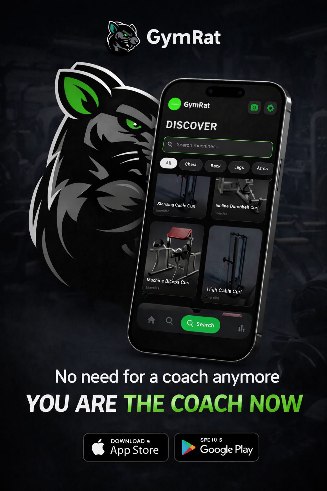
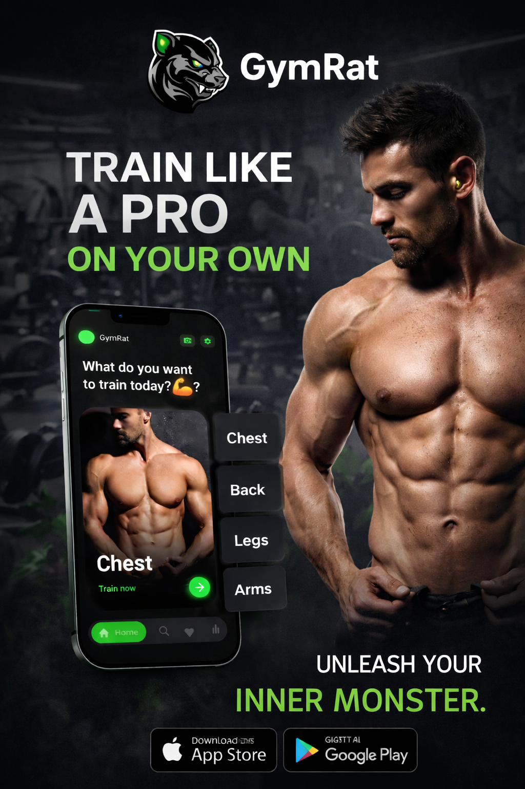

  
  
  
  
  
  
  
  
 

🐭 GymRat
Train Smarter. Lift Better. Track Everything.

GymRat is a modern fitness companion app designed to help gym-goers train efficiently, track workouts, and understand gym machines with the power of AI.
Whether you’re a beginner or an advanced athlete, GymRat turns your phone into a smart personal trainer 💪🤖.

🚀 Features
🏋️‍♂️ Smart Exercise Library

Curated list of gym exercises

Clear explanations and structured routines

Covers major muscle groups

🤖 AI-Powered Machine Detection (Experimental)

Detect gym machines using AI

Identify the machine and show how to use it

Helps beginners avoid confusion and injury

📊 Workout Tracking

Log sets, reps, and weights

Track progress over time

Build consistent training habits

📱 Clean & Modern UI

Simple, minimal, and user-friendly design

Built with performance and usability in mind

🧠 Motivation Behind GymRat

Many people walk into the gym feeling lost, especially beginners:

“Which machine is this?”

“Am I using it correctly?”

“What exercise should I do today?”

GymRat was built to solve these problems by combining:

Fitness knowledge

Mobile development

Artificial Intelligence

“Knowledge builds confidence. Confidence builds strength.” 💥

🛠️ Tech Stack

Flutter – Cross-platform mobile development

Dart – App logic

Firebase – Backend & database

AI / Computer Vision – Machine detection module

REST APIs – Data communication
